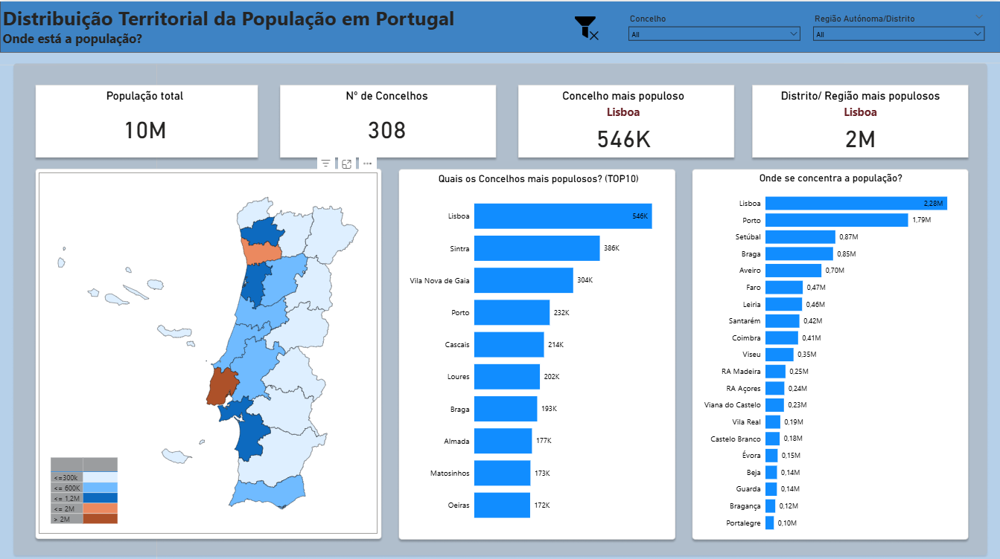
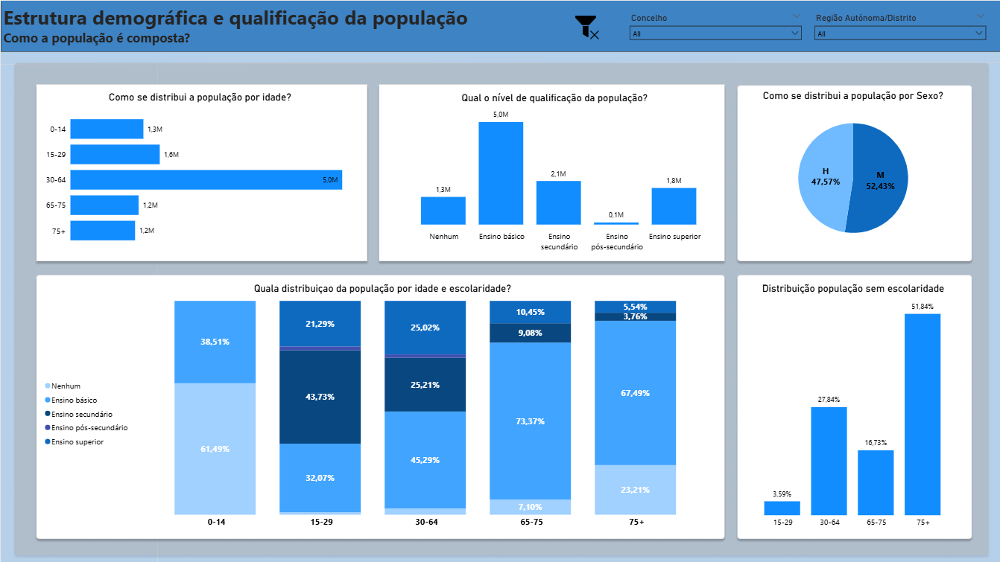
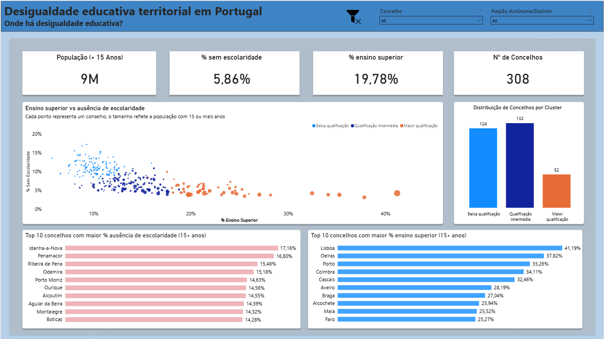
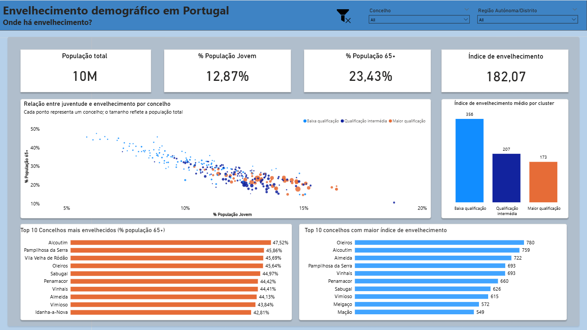
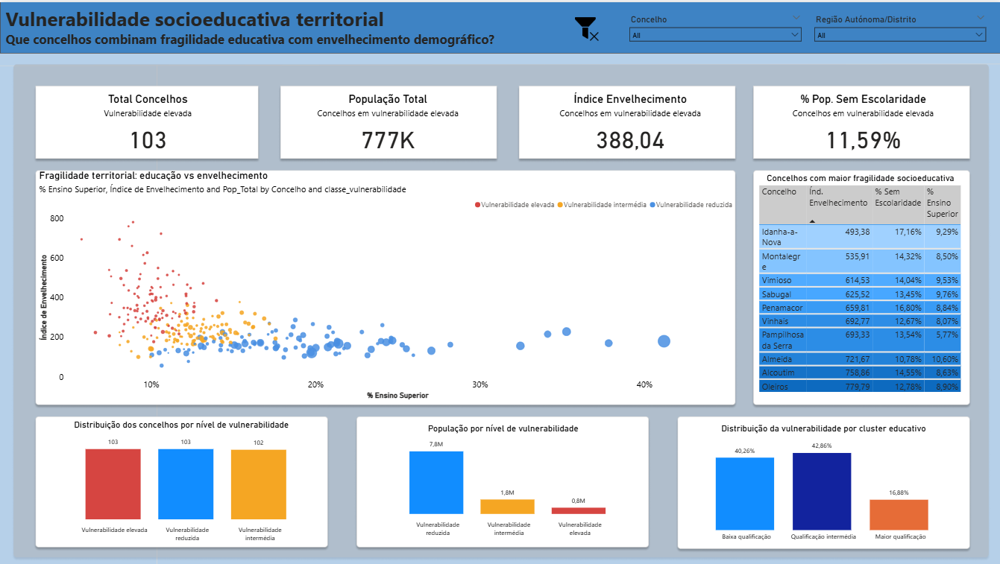

# 🇵🇹 Portugal Census 2021 — Educational & Demographic Fragility Analysis

Territorial analysis of Portugal’s 2021 Census data, focusing on demographic ageing, educational levels, and socio-educational vulnerability across municipalities.

---

## 📊 Project Overview

This project explores how demographic structure and educational attainment vary across Portuguese municipalities, aiming to identify territories facing higher socio-educational fragility.

The analysis combines:
- Population structure (age groups, gender)
- Educational attainment
- Demographic ageing
- Clustering and vulnerability scoring

---

## ❓ Key Business Questions

1. Which territories show the highest demographic ageing and loss of young population?
2. Where are the biggest disparities between population structure and educational attainment?
3. Which municipalities present the most fragile socio-educational profiles?
4. How do demographic patterns vary across districts and regions?

---

## 🧠 Methodology

### Data Source
- Portugal Census 2021 (INE)

### Data Processing
- Cleaning and transformation using Python (Pandas)
- Feature engineering for demographic and educational indicators
- Creation of analytical datasets at municipality level

### Analysis
- Exploratory Data Analysis (EDA)
- K-Means clustering (k=3) for educational segmentation
- Composite vulnerability score combining:
  - Ageing index
  - % population without schooling
  - % higher education

### Visualization
- Power BI dashboard with interactive filtering
- Multi-page analytical storytelling

---

## 📈 Dashboard Pages

### 1. Territorial Overview
- Total population and distribution
- Most populated municipalities and regions
- Geographic visualization (map)

---

### 2. Population Structure
- Distribution by age groups, gender, and education
- Cross-analysis of age and education

---

### 3. Educational Fragility
- Relationship between higher education and lack of schooling
- Identification of educational disparities
- Clustering of municipalities

---

### 4. Demographic Ageing
- Ageing index and elderly population distribution
- Relationship between youth and ageing

---

### 5. Socio-Educational Vulnerability
- Composite vulnerability classification (low, medium, high)
- Identification of high-risk municipalities
- Distribution of vulnerability across clusters

---

## 🗂️ Repository Structure
censos-pt-demografia/
│
├── data/
│ ├── raw/ # Original data sources (INE)
│ ├── processed/ # Cleaned and analytical datasets
│ └── shapes/ # GeoJSON files for map visualizations
│
├── notebooks/ # Data preparation and analysis
├── powerbi/ # Final dashboard (.pbix)
├── sql/ # SQL scripts for analytical tables
├── images/ # Dashboard screenshots
│
├── requirements.txt
└── README.md

---

## 🛠️ Tools & Technologies

- Python (Pandas, NumPy)
- Scikit-learn (clustering)
- SQL (SQLite)
- Power BI
- VS Code

---

## 🤖 Use of Generative AI

Generative AI tools were used as a supporting resource throughout the project, particularly for:

- Structuring the analytical approach and workflow
- Assisting in code refinement and optimization (Python, DAX, SQL)
- Supporting documentation and project organization

All core decisions, data modeling, analytical logic, and interpretation of results were designed and validated independently.

The use of AI was strictly complementary, aimed at improving efficiency and clarity rather than replacing analytical reasoning.

---

## 🚀 Key Insights

- Interior regions show significantly higher ageing and lower educational attainment
- Coastal and metropolitan areas concentrate higher education levels
- Some municipalities present **combined risk factors**: ageing + low education
- Clustering reveals distinct territorial profiles beyond administrative divisions

---

## ⚠️ Limitations

- The analysis is based on a **single snapshot (Census 2021)**, without temporal comparison
- Some indicators rely on **aggregated categories**, which may mask finer-grained patterns
- The vulnerability score is a **simplified composite metric**, based on selected variables and assumptions
- The analysis focuses on **municipality level**, without deeper granularity (e.g., parish level)
- External factors such as income, employment, or migration dynamics were not included

These limitations should be considered when interpreting results, particularly for policy or decision-making contexts.

---

## 🚀 Future Improvements

This project is not intended as a final product, but as a foundation for further exploration.

Potential next steps include:

- Incorporating **foreign population data** to analyse integration and demographic pressure
- Adding **time-series analysis** (if historical data becomes available)
- Expanding the vulnerability model with **economic and social indicators** (income, employment, etc.)
- Refining the analysis to **lower geographic levels** (e.g., parish)
- Enhancing geospatial analysis using **NUTS classifications**
- Publishing the dashboard via **Power BI Service** for full interactivity
- Developing a **predictive or clustering extension** using additional features

This project is part of an ongoing analytical journey and may evolve into multiple complementary analyses.

---

## 📬 Contact

If you found this project interesting or relevant, feel free to connect:

- LinkedIn: *(https://www.linkedin.com/in/hugo-lopes-883747103/)*

---